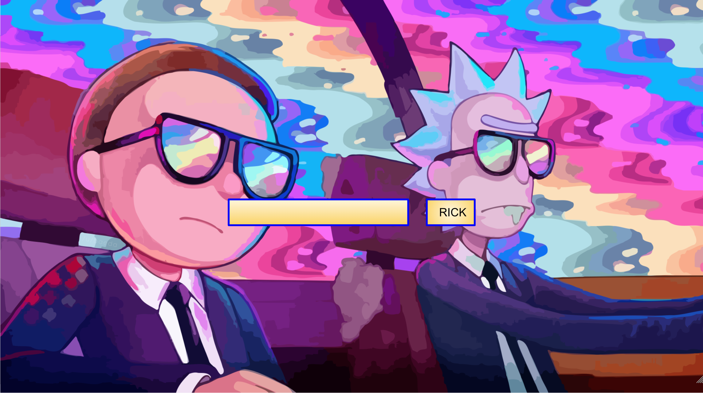
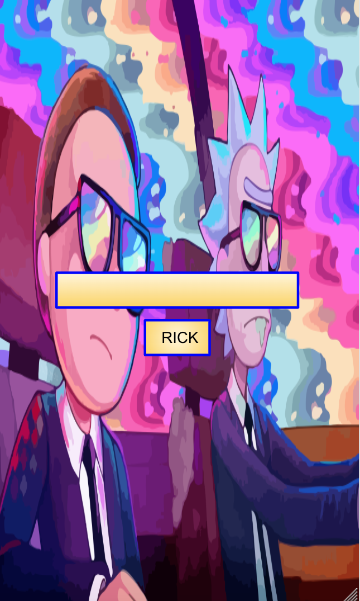

# The Rick & Morty Experience

- During The Rick & Morty experience you will be able to locate any and all; Seasons, Episodes, Characters, Species, and even some cool locations that Rick & Morty have traveled too during their time together. Some small features would include a hover function to change Rick to Morty when you hover over the submit button and popular qoutes from the show will appear each time the page is reloaded. 

### Technologies Used

- Jquery
- HTML
- CSS
- JavaScript
- Json
- Vercel
- Rick & Morty API's

### Wireframes

### Daily Plan

| Day | Goal |
|-----|------|
| 1 - Saturday| Choose API |
| 2 - Sunday  | Render data to screen |
| 3 - Monday  | Create form |
| 4 - Tuesday  | Style the page for a user friendly experience |
| 5 - Wednesday  | Add any additional pictures / buttons / drop downs if needed|
| 6 - Thursday  | Review app and make sure everything is running smoothly |
| 7 - Friday | Submit Project 1 |
| 8 - Saturday | Present Project 1 to group 

### Link to Project
[My Project Live Page](https://project-1-wheat.vercel.app/)